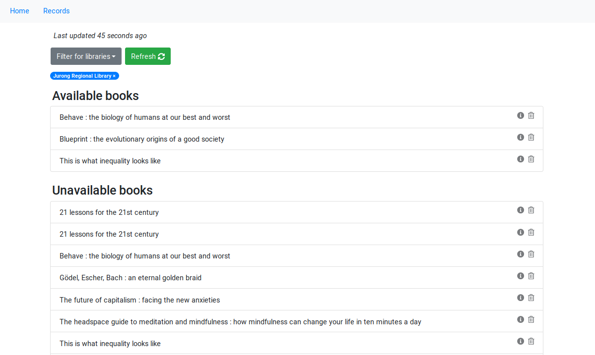
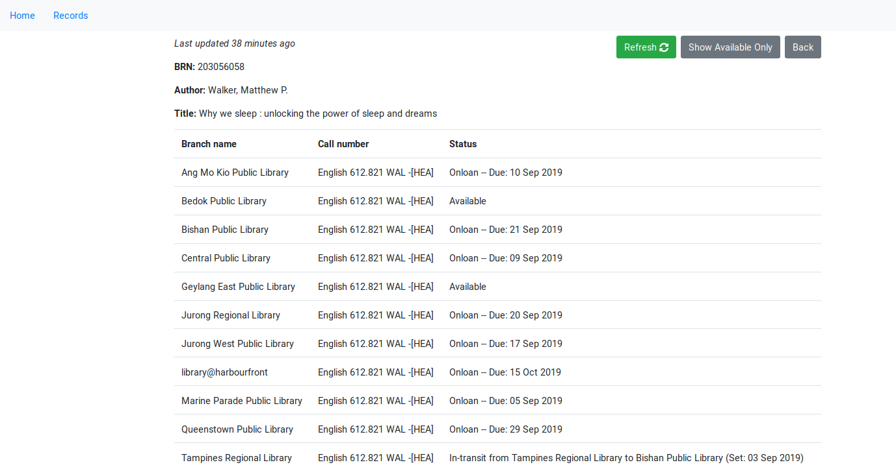
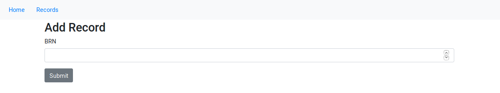

# NLB availability tracker

This app lets you easily track the availabilities of the NLB books you want to borrow.

I created this because I was tired of using the NLB catalogue, where you have to manually search through your list of books *one at a time* to find out if and where they're available -- and that's terribly inefficient.

We can do better! This app helps you do both these things at the same time:
1. Track the list of books you want to borrow; and
2. Refresh the availabilities of these books and see where they're available with a simple button click.

# User guide

The front page contains a list of all the NLB books that you want to borrow, separating them into two sections: those that are available, and those that are not (as of your most recent refresh).

To refresh all availability information, simply click on the 'Refresh' button. Wait a little while, and everything will be magically updated for you!

You may filter for specific libraries that you're interested in, which updates the two sections to display the books that are available and unavailable at those libraries respectively.



You can see more detailed information regarding a specific book if you'd like:



To add a book to your list, navigate to the 'Record' tab, copy NLB's Book Reference Number (BRN) of the book you wish to add, and click 'Submit'. It's clunky, I know, but I've lived with it okay for the past couple months, though I expect to change it eventually.



# Developer guide

First, install the relevant dependencies with the following:

```
$ npm install
$ cd client && npm install
```

## Setting up development server

Express backend: use port 3000.
```
$ PORT=3000 npm run devstart
```

React frontend: use port 5000.
```
$ cd client && PORT=5000 npm start
```

Test changes in the React app (`localhost:5000`). (Otherwise, you have to `$ npm run build` everytime you make changes to have it show on the Express app.)
The React app has been configured to use the backend as a proxy on port 3000.

## Setting up database

Ensure that postgres is first installed.

To create and migrate the `nlb` database, run the following:

```
$ npx sequelize db:create
$ npx sequelize db:migrate
```

## Deploying for production (on Heroku)

Express will serve the static files in `client/build`.
On post-build, add a `heroku-postbuild` hook in package.json:
```
"scripts": {
  "start": "node index.js", // or whatever
  "heroku-postbuild": "cd client && npm install && npm run build"
}
```

The Express app will be served, adding static files from the React app accordingly.
